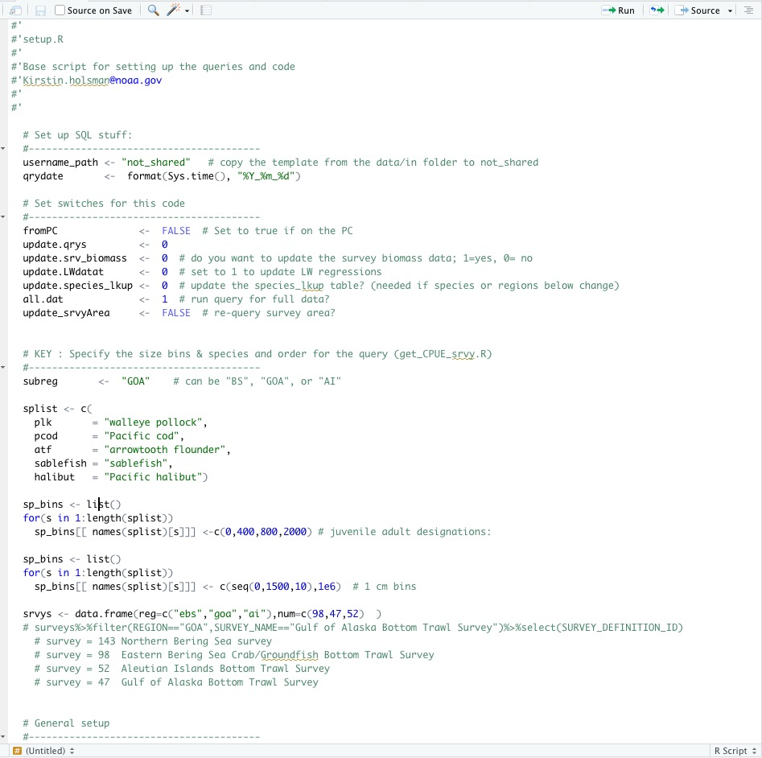

<!-- default, tango, pygments, kate, monochrome, espresso, zenburn, haddock, and textmate. -->

```{r startup, eval=T, echo=F, results=F}
 #source("R/make.R")       # loads packages, data, setup, etc.
 knitr::opts_chunk$set(echo = TRUE, fig.align="center")
 thisYr <- format(Sys.time(), "%Y")
 today  <- format(Sys.time(), "%b %d, %Y")
  suppressMessages(source("R/setup.R"))
 
```

#### [**AFSC Survey CPUE data: github.com/kholsman/AFSC_CPUE**](https://github.com/kholsman/AFSC_CPUE "AFSC_CPUE code Repo")  
  Repo maintained by:  
  Kirstin Holsman  
  Alaska Fisheries Science Center  
  NOAA Fisheries, Seattle WA  
  **[kirstin.holsman@noaa.gov](kirstin.holsman@noaa.gov)**  
  *Last updated: `r today`*

# Overview

The below scripts return a list object cpue_data saved as a compressed Rdata file with the naming 'reg.srvy#.spp.cpue_data.Rdata' such as "ebs.srvy98.plk.cpue_data.Rdata". Each cpue_data list contains 8 data.frames:

```{r viewcpue_data2, echo=TRUE, eval=FALSE} 

load(paste0("data/out/",qrydate,"/cpue/ebs/ebs.srvy98.plk.cpue_data.Rdata"))

names(cpue_data)

```  
 
There is a folder for each region "ebs", "goa", "ai". For the "ebs" (Bering Sea) there are two sets of cpue_data, one that is NEBS+SEBS combined ('ebs.srvy98.[sp].cpue_data.Rdata') and one that is just SEBS survey areas ('sebs.srvy98.[sp].cpue_data.Rdata'). For both the Gulf of Alaska ("goa") and the Bering Sea, mean CPUE (Kg per km2 or Number per km2) for each size bin at each strata was calculated and then multiplied by the STRATA area to get total Biomass and abundance. 
**Note:Since strata area estimates where not available for the Aleutian Island ("ai") or slope surveys ("slope") these AREA was set equal to 1 and the Total Biomass and abundance is actually the sum of mean biomass. **


The data.frames within each cpue_data object are:

1. **totalB_N**: Total biomass (kg) or abundance (# of fish) for the species in each year  
2. **mnCPUE_strata_yr** : Average survey CPUE (kg per Km2) or abundance (# per Km2) for the species in each strata and year  
3. **total_bin_B_N**: Total biomass (kg) or abundance (# of fish) for each bin (10 mm) for the species in each year   
4. **mnCPUE_strata_bin_yr** : Average survey CPUE (kg per Km2) or abundance (# per Km2) for each size bin for the species in each strata and year
5. **CPUE_station_bin_yr**: Station specific survey CPUE (kg per Km2) or abundance (# per Km2) for each size bin for the species in each year    
6. **CPUE_station_yr**: Station specific survey CPUE (kg per Km2) or abundance (# per Km2) for the species in each year  
7. **propByBin**: proportion of biomass in each size bin per species per year  
8. **propByStrata**: proportion of biomass in each strata per species per year
9. **propByStrataBin**: proportion of biomass in each bin and strata per species per year


These are calculated from the RACEBASE data tables for survey results where total CPUE was recorded for the species $s$ (location_catch) at each haul, expanded to include stations $i$ where CPUE=0 (location) and expanded to each size bin $l$ using the proportional subset of frequency of fish of given length (mm), binned into 10 mm bins ($l$) and predicted weight ($\hat{W}$) for each size bin $l$ at each station $i$:

$$B_{s,y} =  \bar{CPUE_{s,k,y}} \dot{}A_{k}$$
where $A_{k}$ is the area of the strata $k$ in $Km^2$ and $\bar{CPUE_{s,k,y}}$ is the strata specific average CPUE (kg per $Km^2$ or number per $Km^2$) of all stations $i$ in strata $k$:
$$\bar{CPUE_{s,k,y}} = \frac{1}{n_k}\dot{}\sum_{n_k}{CPUE_{s,k,y,i}}$$
where $ CPUE_{s,k,y,i} $ is the station specific CPUE (saves as the object `cpue_data$CPUE_station_yr`).

To obtain population level estimates of the biomass or abundance of fish by size bin $l$, we used a length weight regression to esimate the weight of each size fish $j$ measured ($\hat{W}$) to calculate the proportion by weight or frequency at each station where
$$\hat{W} = \alpha_s+L_j^{\beta_s} $$
where $\alpha_s$ and $\beta_s$ are fit (updated each year) to all available length and weight data from surveys from all years across the EBS, GOA, and AI (rather than each basin separately) and 
$$p^w_{l,i} = \frac{N_{l,i}\dot{}\hat{\bar{W_{l,i}}}}{\sum_{}{N_{l,i}\dot{}\hat{\bar{W_{l,i}}}}}$$
and
$$p^N_{l,i} = \frac{N_{l,i}}{\sum_{}{N_{l,i}}}$$
This was then multiplied by the CPUE at each station ($CPUE_{s,k,y,i}$) to obtain a station estimate of CPUE by size bin $l$
$$CPUE_{s,k,y,l,i} = p^N_{l,i}\dot{}CPUE_{s,k,y,i}$$

Finally, the average strata CPUE ($\bar{CPUE_{s,k,y,l}}$) and whole of EBS biomass by size bin ($B_{s,y,l}$) was calculated as:
$$\bar{CPUE_{s,k,y,l}} = \frac{1}{n_k}\dot{}\sum_{n_k}{CPUE_{s,k,y,l,i}}$$
and
$$B_{s,y,l}= \frac{\bar{CPUE_{s,k,y,l}}\dot{}A_{k}}{\sum_{n_k}{\bar{CPUE_{s,k,y,l}}\dot{}A_{k}}}\dot{}B_{s,y}$$


# Comparison of Bering Sea survey values


# Code  

```{r updateSQL, echo = TRUE, eval = FALSE}

# ## Step 0: Set up the R workspace
# 
# The first step is to set up the switches for what files to update and create in the file `R/setup.R`. The code below then loads these settings as well as base data, functions, and packages. 
# 
# ## Step 1: Update SQL queries
# This step must be run on a computer that has access to RACEBASE. The code below will generate the base files for steps 2 and 3 below,and will save them in the folder `r data.path ` under subfolders for each region in `srvys$reg` and each species in `splist` (see `R/setup.R` to change these settings).

# **IMPORTANT:**  
#   
#   * **This step  must be connected to the RACEBASE SQL database**
#   
#   * **To change R studio from the default 64 bit to 32 bit go to Tools>Global options and select the 32 bit version of R.**   
#   
#   * **The code will connect to the SQL database using your password and username. Remember to update the `username_path` in the first line of the `R/setup.R ` file and corresponding `username` and `password` under `username_password.R`. A template is available under `R/`.**
# 
# <!-- {width=80%} -->
# 
 
  
  # get everything set up:
  #----------------------------------------
    # rm(list=ls())
    # this uses the password saved in R/password.R
    suppressMessages(source("R/make.R"))

  # update the SQL queries
  #---------------------------------------------  

  source(file.path(code.path,"R/sub_scripts/runRACE_qrys.R"))

  # combine sebs and nebs into one region: ebs
  if(dir.exists(file.path(data.path,"ebs")))
      system(paste("rm -r",file.path(data.path,"ebs")))
    dir.create(file.path(data.path,"ebs"))
  
  # combine files and rename survey area to all of EBS
  for(sp in names(splist)){
    if(dir.exists(file.path(data.path,"ebs",sp)))
      system(paste("rm -r",file.path(data.path,"ebs",sp)))
      dir.create(file.path(data.path,"ebs",sp))
    #"length.Rdata"         
    load(file.path(data.path,"nebs",sp,"length.Rdata"))
    length_nebs <- length;rm(length)
    load(file.path(data.path,"sebs",sp,"length.Rdata"))
    length_sebs <- length;rm(length)
    length<- rbind(length_nebs%>%
      mutate(SURVEY_DEFINITION_ID_aka =SURVEY_DEFINITION_ID,SURVEY_DEFINITION_ID =98),
     length_sebs%>%
      mutate(SURVEY_DEFINITION_ID_aka =SURVEY_DEFINITION_ID,SURVEY_DEFINITION_ID =98))
    
    save(length,file = file.path(data.path,"ebs",sp,"length.Rdata"))
    rm(length)
    
    #"location.Rdata"        
    load(file.path(data.path,"nebs",sp,"location.Rdata"))
    location_nebs <- location;rm(location)
    load(file.path(data.path,"sebs",sp,"location.Rdata"))
    location_sebs <- location;rm(location)
    location<- rbind(location_nebs, location_sebs)
    
    save(location,file = file.path(data.path,"ebs",sp,"location.Rdata"))
    
    
    #"location_catch.Rdata"
    load(file.path(data.path,"nebs",sp,"location_catch.Rdata"))
    location_catch_nebs <- location_catch;rm(location_catch)
    load(file.path(data.path,"sebs",sp,"location_catch.Rdata"))
    location_catch_sebs <- location_catch;rm(location_catch)
    location_catch <- rbind(location_catch_nebs%>%
      mutate(SURVEY_DEFINITION_ID_aka =SURVEY_DEFINITION_ID,SURVEY_DEFINITION_ID =98),
     location_catch_sebs%>%
      mutate(SURVEY_DEFINITION_ID_aka =SURVEY_DEFINITION_ID,SURVEY_DEFINITION_ID =98))
    
    save(location_catch,file = file.path(data.path,"ebs",sp,"location_catch.Rdata"))
    
  }


    
#```


## Step 2: Update the LWA regressions

# The default code for RACEBASE uses set LW relationships, however we prefer to update the LW regressions using glms. Depending on how many observations exist the LW relationships can be region specific or use data across all regions.The default below is all regions combined. This code generates two outputs in `r data.out`, `r LWname` and `LW_SmryTable.Rdata`. It also updates the `species_lkup$LW_a` and species_lkup$LW_b` parms used in Step 3.
# 
# #```{r updateLWglms, echo=TRUE, eval=FALSE}    

  # update the LW regressions 
  #---------------------------------------------  

  if(update_LWdata){ 	
     source(file.path(code.path,"R/sub_scripts/updateLW.R"))
     # reload with updated data:
     source(file.path(code.path,"R/load_data.R"))
  }
  species_lkup

#```


## Step 3: Get CPUE data from the surveys

#This code is the core script for generating the CPUE_NUMKM2 and CPUE_BIOMKM2 values by size bin, region, and species. 

#```{r updateCPUE, echo=TRUE, eval=FALSE} 
  
  STRATA_AREA%>%filter(REGION=="BS")%>%
    group_by(YEAR)%>%summarise(mnAREA  = mean(AREA, na.rm=T),
                               sumAREA = sum(AREA, na.rm=T),
                               cnt = length(unique(STRATUM)))
  
   STRATA_AREA%>%filter(REGION=="GOA")%>%
    group_by(YEAR)%>%summarise(mnAREA  = mean(AREA, na.rm=T),
                               sumAREA = sum(AREA, na.rm=T),
                               cnt = length(unique(STRATUM)))
  
   STRATA_AREA%>%filter(REGION=="BS",YEAR==2022)%>%select(STRATUM)

   # overwrite the NEBS frame from setup for the next set of code (ebs = sebs+nebs now forward)
  srvys <- data.frame(reg=c("ebs","goa","ai","slope"),RGN = c("BS","GOA","AI","SLOPE"), num=c(98,47,52,78)  )
  # srvys <- data.frame(reg=c("ebs","goa","ai"),RGN = c("BS","GOA","AI"), num=c(98,47,52)  )
  nreg <- length(srvys$reg)
  nspp <- length(species_lkup$sp)
  
  for (r in 1:nreg){
    for(s in 1:nspp){
      
      if(srvys[r,]$reg =="ebs"){
        # first SEBS only:
        # -------------------------------
        STRATA_AREAUSE <- STRATA_AREA%>%filter(REGION==srvys$RGN[r])
        maxyr <- max(STRATA_AREAUSE$YEAR)
        STRATA_AREAUSE <- STRATA_AREAUSE%>%
          filter(YEAR==2022)%>%
          group_by(REGION,STRATUM)%>%
          summarize(AREA = mean(AREA, na.rm=T))%>%ungroup()
        
         flnm <- paste0("s",srvys[r,]$reg,".srvy",
                     srvys[r,]$num,".",
                     species_lkup[s,]$sp)
        cat("now getting data for: ",flnm,"\n")
        cpue_data <- suppressMessages(
          get_CPUE_DATA(
          datapath   = data.path,
          out_dir    = file.path(data.out),
          STRATA_AREAIN = STRATA_AREAUSE,
          flnm       = flnm,
          species    = species_lkup[s,]$SPECIES_CODE,
          survey     = srvys[r,]$num,
          includeNBS = FALSE,
          NEBSStrataIN = NEBS_strata ,
          saveit     = T,
          bins       = sp_bins[[ species_lkup[s,]$sp ]]))
        
        rm(cpue_data)
        
        # Now NESB + SEBS
        # -------------------------------
        flnm <- paste0(srvys[r,]$reg,".srvy",
                     srvys[r,]$num,".",
                     species_lkup[s,]$sp)
        cat("now getting data for: ",flnm,"\n")
        cpue_data <- suppressMessages(
          get_CPUE_DATA(
          datapath   = data.path,
          out_dir    = file.path(data.out),
          STRATA_AREAIN = STRATA_AREAUSE,
          flnm       = flnm,
          species    = species_lkup[s,]$SPECIES_CODE,
          survey     = srvys[r,]$num,
          includeNBS   = TRUE,
          NEBSStrataIN = NEBS_strata ,
          saveit     = T,
          bins       = sp_bins[[ species_lkup[s,]$sp ]]))
        
      }
      if(srvys[r,]$reg =="goa"){
        STRATA_AREAUSE <- STRATA_AREA%>%filter(REGION==srvys$RGN[r])
        maxyr <- max(STRATA_AREAUSE$YEAR)
        STRATA_AREAUSE <- STRATA_AREAUSE%>%
          filter(YEAR==1993)%>%
          group_by(REGION,STRATUM)%>%
          summarize(AREA = mean(AREA, na.rm=T))%>%ungroup()
        
        flnm <- paste0(srvys[r,]$reg,".srvy",
                     srvys[r,]$num,".",
                     species_lkup[s,]$sp)
        cat("now getting data for: ",flnm,"\n")
        cpue_data <- suppressMessages(
          get_CPUE_DATA(
          datapath   = data.path,
          out_dir    = file.path(data.out),
          STRATA_AREAIN = STRATA_AREAUSE,
          flnm       = flnm,
          species    = species_lkup[s,]$SPECIES_CODE,
          survey     = srvys[r,]$num,
          includeNBS = FALSE,
          NEBSStrataIN = NEBS_strata ,
          saveit     = T,
          bins       = sp_bins[[ species_lkup[s,]$sp ]]))
        
      }
      if(!srvys[r,]$reg%in%c("ebs","goa")){
        flnm <- paste0(srvys[r,]$reg,".srvy",
                     srvys[r,]$num,".",
                     species_lkup[s,]$sp)
        cat("now getting data for: ",flnm,"\n")
        cpue_data <- suppressMessages(
          get_CPUE_DATA(
          datapath   = data.path,
          out_dir    = file.path(data.out),
          STRATA_AREAIN = NULL,
          flnm       = flnm,
          species    = species_lkup[s,]$SPECIES_CODE,
          survey     = srvys[r,]$num,
          includeNBS = FALSE,
          NEBSStrataIN = NEBS_strata ,
          saveit     = T,
          bins       = sp_bins[[ species_lkup[s,]$sp ]]))

      }
     
      # # check the data :
      if(1==10){
        tt <- cpue_data%>%
              group_by(YEAR,REGION,STATIONID,SN)%>%
              filter(BIN ==400)%>%
              summarize(cnt =length(STATIONID))
         max(tt$cnt)  #Should be 1
        #this looks to be a duplicate sampling...
        #mis-entry or code error ?
         cpue_data%>%filter(YEAR==1988,STATIONID=="J-13")
      }
       rm(cpue_data)

    }
  }
#   
# ```
# 
# *The cpue files are now saved in the directory `r file.path(data.out,"../")`*
# 
# ```{r viewcpue_data, echo=TRUE, eval=FALSE} 
  # this uses the password saved in R/password.R
  #  suppressMessages(source("R/make.R"))
load(file.path(data.out,"cpue/ebs/ebs.srvy98.pcod.cpue_data.Rdata"))

names(cpue_data)

library(dplyr)

checkit <-function(x){
   if(round(max(x ),1)!=1) {
     warning("ERROR! propB > 1 ")
     print(x)}
  
}

  #double check the results
  cnt_ByStrataBin <- cpue_data$propByStrataBin%>%
    select("REGION","YEAR","STRATUM",BIN,BIN_mm,
           SPECIES_CODE,CN,SN,sp,num,
           "propB_ykl","propN_ykl")%>%
    group_by(YEAR,REGION,SN,CN)%>%
    summarise(sum_propB_ykl=sum(propB_ykl,na.rm=T),
              sum_propN_ykl=sum(propN_ykl,na.rm=T))
  
  cnt_ByStrata <- cpue_data$propByStrata%>%
    select("REGION","YEAR","STRATUM",
           SPECIES_CODE,CN,SN,sp,num,
           "propB_yk","propN_yk")%>%
    group_by(YEAR,REGION,SN,CN)%>%
    summarise(sum_propB_yk=sum(propB_yk,na.rm=T),
              sum_propN_yk=sum(propN_yk,na.rm=T))
    
  cnt_ByBin <- cpue_data$propByBin%>%
    select("REGION","YEAR",BIN,BIN_mm,num,
           SPECIES_CODE,CN,SN,sp,
           "propB_yl","propN_yl")%>%
    group_by(YEAR,REGION,SN,CN)%>%
    summarise(sum_propB_yl=sum(propB_yl ,na.rm=T),
              sum_propN_yl=sum(propN_yl ,na.rm=T))
  
  checkit(cnt_ByStrataBin$sum_propB_ykl)
  checkit(cnt_ByStrata$sum_propB_yk)
  checkit(cnt_ByBin$sum_propB_yl)
  
# 
```  


```{r Bage, include=F,eval=F}

update_LWdata   =  FALSE 
update_lkups    =  FALSE
#suppressMessages(source("R/make.R"))
suppressMessages(source("R/setup.R"))
suppressMessages(source("R/packages.R"))
load(file.path("data/in/lookup_files","species_lkup.Rdata"))


source("data/in/lookup_files/2022_assessmentB.R")
  # load obs data

load(file.path(data.out,"cpue/ebs/sebs.srvy98.plk.cpue_data.Rdata"))
cpue2plk <- cpue_data; rm(cpue_data)
load(file.path(data.out,"cpue/ebs/ebs.srvy98.plk.cpue_data.Rdata"))
cpue1plk <- cpue_data; rm(cpue_data)
load(file.path(data.out,"cpue/ebs/sebs.srvy98.pcod.cpue_data.Rdata"))
cpue2pcod <- cpue_data; rm(cpue_data)
load(file.path(data.out,"cpue/ebs/ebs.srvy98.pcod.cpue_data.Rdata"))
cpue1pcod <- cpue_data; rm(cpue_data)
load(file.path(data.out,"cpue/ebs/sebs.srvy98.atf.cpue_data.Rdata"))
cpue2atf <- cpue_data; rm(cpue_data)
load(file.path(data.out,"cpue/ebs/ebs.srvy98.atf.cpue_data.Rdata"))
cpue1atf <- cpue_data; rm(cpue_data)

compare_plot <- function(obsIN = obs,cpue1, cpue2, spIN="plk"){
  tmp  <- obs%>%filter(species==spIN)
  spnm <- species_lkup[species_lkup$sp==spIN,]$COMMON_NAME
  p    <- ggplot()+
    geom_line(data=cpue2$totalB_N,aes(x=YEAR,y=B_KG_y, color ="SEBS"),size=.8)+
    geom_line(data=cpue1$totalB_N,aes(x=YEAR,y=B_KG_y, color ="SEBS+ NEBS"),size=.8)+
    geom_point(data=cpue1$totalB_N,aes(x=YEAR,y=B_KG_y, color ="SEBS+ NEBS"),size=2)+
    geom_errorbar(data=cpue1$totalB_N,
                  aes(x=YEAR,ymin=(B_KG_y-seB_KG_y ),ymax=(B_KG_y+seB_KG_y), color ="SEBS+ NEBS"))+
    geom_line(data=tmp,
               aes(x=YEAR,y=totB*1000, color ="CEATTLE (vast?) NEBS+SEBS"),size=.8)+
    geom_point(data=tmp,
               aes(x=YEAR,y=totB*1000, color ="CEATTLE (vast?) NEBS+SEBS"),size=2)+
    geom_errorbar(data=tmp,
               aes(x=YEAR,ymin=(totB-totBse)*1000,ymax=(totB+totBse)*1000, color ="CEATTLE (vast?) NEBS+SEBS"))+theme_minimal()+ggtitle(spnm)
  return(p)
}

p_plk  <- compare_plot(obsIN = obs,cpue1 = cpue1plk, cpue2  = cpue2plk, spIN = "plk")
p_pcod <- compare_plot(obsIN = obs,cpue1 = cpue1pcod, cpue2 = cpue2pcod,spIN = "pcod")  
p_atf  <- compare_plot(obsIN = obs,cpue1 = cpue1atf, cpue2  = cpue2atf, spIN = "atf")  

jpeg(file="Figs/plk_srvy.jpg", width = 9, height = 4, res = 350,units="in")
print(p_plk)
dev.off()

jpeg(file="Figs/pcod_srvy.jpg", width = 9, height = 4, res = 350,units="in")
print(p_pcod)
dev.off()

jpeg(file="Figs/atf_srvy.jpg", width = 9, height = 4, res = 350,units="in")
print(p_atf)
dev.off()


```


## Appendix 1: `R/setup.R`primary setup script

<!-- {width=90%} -->

```{r makeReadME, echo=FALSE,eval=F, include =F}
 
 # suppressMessages(source("R/make.R"))
 suppressMessages(source("R/setup.R"))
 suppressMessages(source("R/packages.R"))
 load(file.path("data/in/lookup_files","species_lkup.Rdata"))

 # copy and paste this into R window (won't work within markdown)
 rmd2md(rmd_fl = "HowTo_get_survey_data",md_fl = "README")

```


