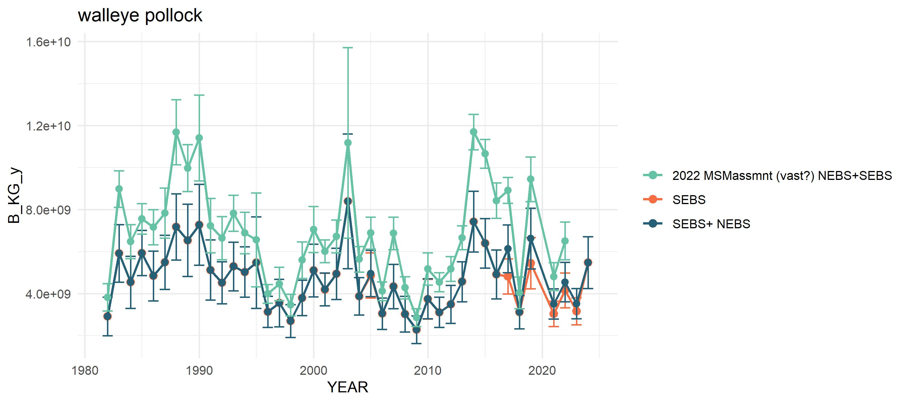
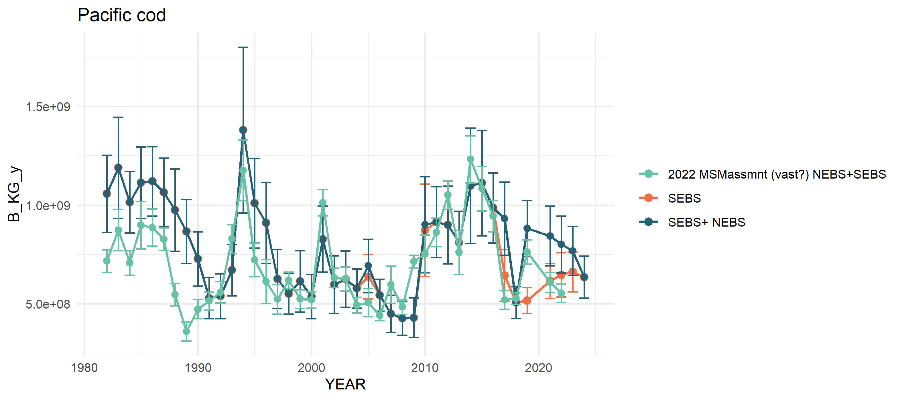
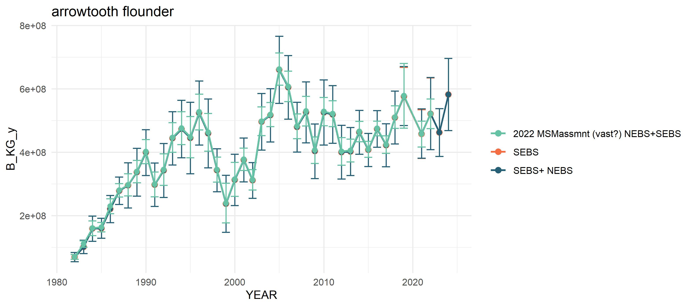

<!-- default, tango, pygments, kate, monochrome, espresso, zenburn, haddock, and textmate. -->

#### [**AFSC Survey CPUE data: github.com/kholsman/AFSC_CPUE**](https://github.com/kholsman/AFSC_CPUE "AFSC_CPUE code Repo")

Repo maintained by:  
Kirstin Holsman  
Alaska Fisheries Science Center  
NOAA Fisheries, Seattle WA  
**[kirstin.holsman@noaa.gov](kirstin.holsman@noaa.gov)**  
*Last updated: Oct 02, 2024*

# Overview

The below scripts return a list object cpue_data saved as a compressed
Rdata file with the naming ‘reg.srvy#.spp.cpue_data.Rdata’ such as
“ebs.srvy98.plk.cpue_data.Rdata”. Each cpue_data list contains 8
data.frames:

``` r
load(paste0("data/out/",qrydate,"/cpue/ebs/ebs.srvy98.plk.cpue_data.Rdata"))

names(cpue_data)
```

There is a folder for each region “ebs”, “goa”, “ai”. For the “ebs”
(Bering Sea) there are two sets of cpue_data, one that is NEBS+SEBS
combined (‘ebs.srvy98.\[sp\].cpue_data.Rdata’) and one that is just SEBS
survey areas (‘sebs.srvy98.\[sp\].cpue_data.Rdata’). For both the Gulf
of Alaska (“goa”) and the Bering Sea, mean CPUE (Kg per km2 or Number
per km2) for each size bin at each strata was calculated and then
multiplied by the STRATA area to get total Biomass and abundance.
**Note:Since strata area estimates where not available for the Aleutian
Island (“ai”) or slope surveys (“slope”) these AREA was set equal to 1
and the Total Biomass and abundance is actually the sum of mean biomass.
**

The data.frames within each cpue_data object are:

1.  **totalB_N**: Total biomass (kg) or abundance (# of fish) for the
    species in each year  
2.  **mnCPUE_strata_yr** : Average survey CPUE (kg per Km2) or abundance
    (# per Km2) for the species in each strata and year  
3.  **total_bin_B\_N**: Total biomass (kg) or abundance (# of fish) for
    each bin (10 mm) for the species in each year  
4.  **mnCPUE_strata_bin_yr** : Average survey CPUE (kg per Km2) or
    abundance (# per Km2) for each size bin for the species in each
    strata and year
5.  **CPUE_station_bin_yr**: Station specific survey CPUE (kg per Km2)
    or abundance (# per Km2) for each size bin for the species in each
    year  
6.  **CPUE_station_yr**: Station specific survey CPUE (kg per Km2) or
    abundance (# per Km2) for the species in each year  
7.  **propByBin**: proportion of biomass in each size bin per species
    per year  
8.  **propByStrata**: proportion of biomass in each strata per species
    per year
9.  **propByStrataBin**: proportion of biomass in each bin and strata
    per species per year


To obtain population level estimates of the biomass or abundance of fish
by size bin *l*, we used a length weight regression to estimate the
weight of each size fish *j* measured (*Ŵ*) to calculate the proportion
by weight or frequency at each station where
$$\hat{W_j} = \alpha_s+L_j^{\beta_s} $$

where the species-specific (*s*) slope and intercept values
(*β*<sub>*s*</sub> and *α*<sub>*s*</sub>, respectively) were fit to all
available length and weight data from surveys from all years across the
EBS, GOA, and AI (rather than each basin separately).

The number and biomass (*h**a**t**W*<sub>*j*</sub>) for each 1 (mm)
length was summed into 10 mm size bins *l* and expanded to include
stations and bins where CPUE = 0 (saved as the object
`cpue_data$CPUE_station_bin_yr`). Bin-specific catch
$\bar{CPUE}\_{s,k,y,l}$ (kg per *K**m*<sup>2</sup> or number per
*K**m*<sup>2</sup>) of all stations *i* in strata *k* for size bin *l*
(saved as the object `cpue_data$mnCPUE_strata_bin_yr`)::
$$\bar{CPUE}^{B\|N}\_{s,k,y,l}=\frac{1}{n_k}\sum\_{n_k}{CPUE^{B\|N}\_{s,k,y,l,i}}$$

and where
*C**P**U**E*<sub>*s*, *k*, *y*, *l*, *i*</sub><sup>*B*</sup> = ∑<sub>*n*<sub>*l*</sub></sub>*Ŵ*<sub>*j*</sub>
and
*C**P**U**E*<sub>*s*, *k*, *y*, *l*, *i*</sub><sup>*N*</sup> = ∑<sub>*n*<sub>*l*</sub></sub>1
are the station specific CPUEs for biomass and abundance of fish in size
bin l (respectively). CPUE was converted to total strata- and
bin-specific biomass ($B\_{s,k,y,l} $) by multiplying the strata average
catch ( $\bar{CPUE}\_{s,k,y,l}$ ) for each species and bin by the strata
area *A*<sub>*k*</sub> ( *K**m*2; saved as the object
`cpue_data$total_bin_B_N`):

$$B\_{s,k,y,l} =  \bar{CPUE}^{B}\_{s,k,y,l} \dot{}A\_{k}$$
and
$$N\_{s,k,y,l} =  \bar{CPUE}^{N}\_{s,k,y,l} \dot{}A\_{k}$$

We then calculated the proportion of total annual abundance
(*N*<sub>*s*, *y*</sub> = ∑<sub>*k*</sub>∑<sub>*l*</sub>*N*<sub>*s*, *k*, *y*, *l*</sub>)
or biomass
(*B*<sub>*s*, *y*</sub> = ∑<sub>*k*</sub>∑<sub>*l*</sub>*B*<sub>*s*, *k*, *y*, *l*</sub>;
saved as `cpue_data$totalB_N`) of each species and bin *l* in each
strata *k* as (saved as the object `cpue_data$propByStrataBin`):

$$p^N\_{s,k,y,l} = \frac{N\_{s,k,y,l}}{ \sum_k{\sum_l{N\_{s,k,y,l}}}}$$
and
$$p^B\_{s,k,y,l} = \frac{B\_{s,k,y,l}}{ \sum_k{\sum_l{B\_{s,k,y,l}}}}$$
and the proportion of total annual biomass (or abundance) of each
species in each strata as (saved as the object
`cpue_data$propByStrata`):
$$p^B\_{s,k,y} = \frac{\sum_l({B\_{s,k,y,l}})}{ \sum_k{\sum_l{B\_{s,k,y,l}}}}$$

and the proportion of total annual biomass of each species in each bin
l: (saved as the object `cpue_data$propByBin`):
$$p^B\_{s,k,l} = \frac{\sum_k({B\_{s,k,y,l}})}{ \sum_k{\sum_l{B\_{s,k,y,l}}}}$$

# Comparison of Bering Sea survey values







# Code

``` r
# ## Step 0: Set up the R workspace
# 
# The first step is to set up the switches for what files to update and create in the file `R/setup.R`. The code below then loads these settings as well as base data, functions, and packages. 
# 
# ## Step 1: Update SQL queries
# This step must be run on a computer that has access to RACEBASE. The code below will generate the base files for steps 2 and 3 below,and will save them in the folder `r data.path ` under subfolders for each region in `srvys$reg` and each species in `splist` (see `R/setup.R` to change these settings).

# **IMPORTANT:**  
#   
#   * **This step  must be connected to the RACEBASE SQL database**
# 
#   * **The code will connect to the SQL database using your password and username. Remember to update the `username_path` in the first line of the `R/setup.R ` file and corresponding `username` and `password` under `username_password.R`. A template is available under `R/`.**
# 
# <!-- {width=80%} -->
# 
 
  
  # get everything set up:
  #----------------------------------------
    # rm(list=ls())
    # this uses the password saved in R/password.R
    update_qrydate      <-   TRUE  # update the query date
    update_LWdata       <-   TRUE # update LW regressions
    update_lkups        <-   TRUE # update the lookuptables
    suppressMessages(source("R/make.R"))

  # update the SQL queries for goa, ai, sebs and nebs
  #---------------------------------------------  

  source(file.path(code.path,"R/sub_scripts/runRACE_qrys.R"))

  # combine sebs and nebs into one region: ebs
  #---------------------------------------------  
  if(dir.exists(file.path(data.path,"ebs")))
      system(paste("rm -r",file.path(data.path,"ebs")))
    dir.create(file.path(data.path,"ebs"))
  
  # combine files and rename survey area to all of EBS
  for(sp in names(splist)){
    if(dir.exists(file.path(data.path,"ebs",sp)))
      system(paste("rm -r",file.path(data.path,"ebs",sp)))
      dir.create(file.path(data.path,"ebs",sp))
    #"length.Rdata"         
    load(file.path(data.path,"nebs",sp,"length.Rdata"))
    length_nebs <- length;rm(length)
    load(file.path(data.path,"sebs",sp,"length.Rdata"))
    length_sebs <- length;rm(length)
    length<- rbind(length_nebs%>%
      mutate(SURVEY_DEFINITION_ID_aka =SURVEY_DEFINITION_ID,SURVEY_DEFINITION_ID =98),
     length_sebs%>%
      mutate(SURVEY_DEFINITION_ID_aka =SURVEY_DEFINITION_ID,SURVEY_DEFINITION_ID =98))
    
    save(length,file = file.path(data.path,"ebs",sp,"length.Rdata"))
    rm(length)
    
    #"location.Rdata"        
    load(file.path(data.path,"nebs",sp,"location.Rdata"))
    location_nebs <- location;rm(location)
    load(file.path(data.path,"sebs",sp,"location.Rdata"))
    location_sebs <- location;rm(location)
    location      <- rbind(location_nebs, location_sebs)
    
    save(location,file = file.path(data.path,"ebs",sp,"location.Rdata"))
    
    
    #"location_catch.Rdata"
    load(file.path(data.path,"nebs",sp,"location_catch.Rdata"))
    location_catch_nebs <- location_catch;rm(location_catch)
    load(file.path(data.path,"sebs",sp,"location_catch.Rdata"))
    location_catch_sebs <- location_catch;rm(location_catch)
    location_catch      <- rbind(location_catch_nebs%>%
      mutate(SURVEY_DEFINITION_ID_aka =SURVEY_DEFINITION_ID,SURVEY_DEFINITION_ID =98),
     location_catch_sebs%>%
      mutate(SURVEY_DEFINITION_ID_aka =SURVEY_DEFINITION_ID,SURVEY_DEFINITION_ID =98))
    
    save(location_catch,file = file.path(data.path,"ebs",sp,"location_catch.Rdata"))
    
  }

    
#```


## Step 2: Update the LWA regressions

# The default code for RACEBASE uses set LW relationships, however we prefer to update the LW regressions using glms. Depending on how many observations exist the LW relationships can be region specific or use data across all regions.The default below is all regions combined. This code generates two outputs in `r data.out`, `r LWname` and `LW_SmryTable.Rdata`. It also updates the `species_lkup$LW_a` and species_lkup$LW_b` parms used in Step 3.
# 
# #```{r updateLWglms, echo=TRUE, eval=FALSE}    

  # GAP_PRODUCTS.AKFIN_LENGTHS
  # update the LW regressions 
  #---------------------------------------------  

  if(update_LWdata){    
     source(file.path(code.path,"R/sub_scripts/updateLW.R"))
     # reload with updated data:
     source(file.path(code.path,"R/load_data.R"))
  }
  species_lkup
```

## Step 3: Get CPUE data from the surveys

# This code is the core script for generating the CPUE_NUMKM2 and CPUE_BIOMKM2 values by size bin, region, and species.

``` r
  STRATA_AREA%>%filter(REGION=="BS")%>%
    group_by(YEAR)%>%summarise(mnAREA  = mean(AREA, na.rm=T),
                               sumAREA = sum(AREA, na.rm=T),
                               cnt = length(unique(STRATUM)))
  
   STRATA_AREA%>%filter(REGION=="GOA")%>%
    group_by(YEAR)%>%summarise(mnAREA  = mean(AREA, na.rm=T),
                               sumAREA = sum(AREA, na.rm=T),
                               cnt = length(unique(STRATUM)))
  
   STRATA_AREA%>%filter(REGION=="BS",YEAR==2022)%>%select(STRATUM)

   # overwrite the NEBS frame from setup for the next set of code (ebs = sebs+nebs now forward)
   # up above I combine the NEBS+SEBS into the ebs folder and rename the rest NEBS or SEBS accordingly 
   # - so even though the survey number is 98 it;s actually 98 & 143.
  srvys <- data.frame(reg=c("ebs","goa","ai","slope"),RGN = c("BS","GOA","AI","SLOPE"), num=c(98,47,52,78)  )
  # srvys <- data.frame(reg=c("ebs","goa","ai"),RGN = c("BS","GOA","AI"), num=c(98,47,52)  )
  nreg <- length(srvys$reg)
  nspp <- length(species_lkup$sp)
  
  for (r in 1:nreg){
    for(s in 1:nspp){
      
      if(srvys[r,]$reg =="ebs"){
        # first SEBS only:
        # -------------------------------
        STRATA_AREAUSE <- STRATA_AREA%>%filter(REGION==srvys$RGN[r])
        maxyr          <- max(STRATA_AREAUSE$YEAR)
        STRATA_AREAUSE <- STRATA_AREAUSE%>%
          filter(YEAR==2022)%>%
          group_by(REGION,STRATUM)%>%
          summarize(AREA = mean(AREA, na.rm=T))%>%ungroup()
        
        # label "sebs"
         flnm <- paste0("s",srvys[r,]$reg,".srvy",
                     srvys[r,]$num,".",
                     species_lkup[s,]$sp)
        cat("now getting data for: ",flnm,"\n")
        cpue_data <- suppressMessages(
          get_CPUE_DATA(
          datapath   = data.path,
          out_dir    = file.path(data.out),
          STRATA_AREAIN = STRATA_AREAUSE,
          flnm       = flnm,
          species    = species_lkup[s,]$SPECIES_CODE,
          survey     = srvys[r,]$num,
          includeNBS = FALSE,
          NEBSStrataIN = NEBS_strata ,
          saveit     = T,
          bins       = sp_bins[[ species_lkup[s,]$sp ]]))
        
        rm(cpue_data)
        
        # Now NESB + SEBS
        # -------------------------------
        flnm <- paste0(srvys[r,]$reg,".srvy",
                     srvys[r,]$num,".",
                     species_lkup[s,]$sp)
        cat("now getting data for: ",flnm,"\n")
        cpue_data <- suppressMessages(
          get_CPUE_DATA(
          datapath   = data.path,
          out_dir    = file.path(data.out),
          STRATA_AREAIN = STRATA_AREAUSE,
          flnm       = flnm,
          species    = species_lkup[s,]$SPECIES_CODE,
          survey     = srvys[r,]$num,  #? shouldn't this be 98&143? No, I see, up above I combine the NEBS+SEBS into the ebs folder and rename the rest NEBS or SEBS accordingly - so even though the survey number is 98 it;s actually 98 & 143.
          includeNBS   = TRUE,
          NEBSStrataIN = NEBS_strata ,
          saveit     = T,
          bins       = sp_bins[[ species_lkup[s,]$sp ]]))
        
      }
      if(srvys[r,]$reg =="goa"){
        STRATA_AREAUSE <- STRATA_AREA%>%filter(REGION==srvys$RGN[r])
        maxyr <- max(STRATA_AREAUSE$YEAR)
        STRATA_AREAUSE <- STRATA_AREAUSE%>%
          filter(YEAR==1993)%>%
          group_by(REGION,STRATUM)%>%
          summarize(AREA = mean(AREA, na.rm=T))%>%ungroup()
        
        flnm <- paste0(srvys[r,]$reg,".srvy",
                     srvys[r,]$num,".",
                     species_lkup[s,]$sp)
        cat("now getting data for: ",flnm,"\n")
        cpue_data <- suppressMessages(
          get_CPUE_DATA(
          datapath   = data.path,
          out_dir    = file.path(data.out),
          STRATA_AREAIN = STRATA_AREAUSE,
          flnm       = flnm,
          species    = species_lkup[s,]$SPECIES_CODE,
          survey     = srvys[r,]$num,
          includeNBS = FALSE,
          NEBSStrataIN = NEBS_strata ,
          saveit     = T,
          bins       = sp_bins[[ species_lkup[s,]$sp ]]))
        
      }
      if(!srvys[r,]$reg%in%c("ebs","goa")){
        if(species_lkup[s,]$sp=="yfs"&srvys[r,]$reg=="slope"){
          #skip
        }else{
          flnm <- paste0(srvys[r,]$reg,".srvy",
                       srvys[r,]$num,".",
                       species_lkup[s,]$sp)
          cat("now getting data for: ",flnm,"\n")
          cpue_data <- suppressMessages(
            get_CPUE_DATA(
            datapath   = data.path,
            out_dir    = file.path(data.out),
            STRATA_AREAIN = NULL,
            flnm       = flnm,
            species    = species_lkup[s,]$SPECIES_CODE,
            survey     = srvys[r,]$num,
            includeNBS = FALSE,
            NEBSStrataIN = NEBS_strata ,
            saveit     = T,
            bins       = sp_bins[[ species_lkup[s,]$sp ]]))
        }

      }
     
      # # check the data :
      if(1==10){
        tt <- cpue_data%>%
              group_by(YEAR,REGION,STATIONID,SN)%>%
              filter(BIN ==400)%>%
              summarize(cnt =length(STATIONID))
         max(tt$cnt)  #Should be 1
        #this looks to be a duplicate sampling...
        #mis-entry or code error ?
         cpue_data%>%filter(YEAR==1988,STATIONID=="J-13")
      }
       rm(cpue_data)

    }
  }
  
# Now make BT and SST files for strata, station and all basin
  

  # srvys <- data.frame(reg=c("ebs","goa","ai"),RGN = c("BS","GOA","AI"), num=c(98,47,52)  )
  nreg <- length(srvys$reg)

  na.length <- function(x,na.rm=F){
    if(na.rm == T)
       if(any(is.na(x)))
         x <- x[!is.na(x)]
   return( length(x))
  }
  i <-0
  for(regfl in srvys[,1] ){
    if(regfl!="slope"){
    i <- i +1
    load(file.path(data.path,regfl,"plk/location.Rdata"))
    
    tmp<-location%>%group_by(YEAR,STRATUM,STATIONID)%>%
      summarize(
        TEMP=mean(TEMP,na.rm=T),
       # sdTEMP = sd(TEMP,na.rm=T),
        num= na.length(TEMP,na.rm=T),
        SST = mean(SST,na.rm=T),
       # sdSST = sd(SST,na.rm=T),
        LAT=mean(LAT,na.rm=T),
        LON = mean (LON,na.rm=T),
        MONTH = mean(MONTH,na.rm=T),
        DAY = mean (DAY,na.rm=T))%>%mutate(region = regfl)
    
    if(i ==1)
      TEMP <- tmp
    else
      TEMP <- rbind(TEMP,tmp)
    rm(tmp)
}
  }
  TEMP_station <- TEMP
  TEMP_yk <- TEMP%>%group_by(YEAR,STRATUM,region)%>%
      summarize(
        mnTEMP=mean(TEMP,na.rm=T),
        sdTEMP = sd(TEMP,na.rm=T),
        num= na.length(TEMP,na.rm=T),
        mnSST = mean(SST,na.rm=T),
        sdSST = sd(SST,na.rm=T),
        LAT=mean(LAT,na.rm=T),
        LON = mean (LON,na.rm=T),
        MONTH = mean(MONTH,na.rm=T),
        DAY = mean (DAY,na.rm=T))%>%ungroup()
  
  # Now just for EBS and GOA
  
  # -------------------------------
        STRATA_AREAUSE <- STRATA_AREA%>%filter(REGION=="BS")
        STRATA_AREAUSE <- STRATA_AREAUSE%>%
          filter(YEAR==2022)%>%  # updated with revised projection datum. Use 2022
          group_by(REGION,STRATUM)%>%
          summarize(AREA = mean(AREA, na.rm=T))%>%ungroup()
  
  sub<- TEMP_yk%>%
    group_by(YEAR,STRATUM,region)%>%
    filter(region %in% c("nebs","sebs"))%>%
    mutate(REGION = "BS")%>%
    left_join(STRATA_AREAUSE)%>%
    ungroup()
  
  sub<- sub%>%
    left_join(
      sub%>%group_by(YEAR,STRATUM,REGION)%>%
        summarize(AREA = unique(AREA))%>%ungroup()%>%
        group_by(YEAR,REGION)%>%
        summarize(sumAREA=sum(AREA,na.rm=T)))%>%
    mutate(propA = AREA/sumAREA)%>%ungroup()
    
  
  sub%>%group_by(YEAR,REGION)%>%
        summarize(sum(propA,na.rm=T))
  
  
  SEBS_NEBS_TEMP_y <- sub%>%
    group_by(YEAR,REGION)%>%
    summarize(
        mnTEMP = sum(mnTEMP*propA,na.rm=T),
        sdTEMP = sum(sdTEMP*propA,na.rm=T),
        mnSST  = sum(mnSST*propA,na.rm=T),
        sdSST  = sum(sdSST*propA,na.rm=T),
        num    = sum(num,na.rm=T),
        MONTH  = sum(MONTH*propA,na.rm=T),
        DAY    = sum (DAY*propA,na.rm=T))%>%ungroup()
  
  # now just the NEBS:
  sub<- TEMP_yk%>%
    group_by(YEAR,STRATUM,region)%>%
    filter(region %in% c("nebs"))%>%
    mutate(REGION = "BS")%>%
    left_join(STRATA_AREAUSE)%>%
    ungroup()
  
  sub<- sub%>%
    left_join(
      sub%>%group_by(YEAR,STRATUM,REGION)%>%
        summarize(AREA = unique(AREA))%>%ungroup()%>%
        group_by(YEAR,REGION)%>%
        summarize(sumAREA=sum(AREA,na.rm=T)))%>%
    mutate(propA = AREA/sumAREA)%>%ungroup()
  
  sub%>%group_by(YEAR,REGION)%>%
        summarize(sum(propA,na.rm=T))
  
  
  NEBS_TEMP_y <- sub%>%
    group_by(YEAR,REGION)%>%
    summarize(
        mnTEMP = sum(mnTEMP*propA,na.rm=T),
        sdTEMP = sum(sdTEMP*propA,na.rm=T),
        mnSST  = sum(mnSST*propA,na.rm=T),
        sdSST  = sum(sdSST*propA,na.rm=T),
        num    = sum(num,na.rm=T),
        MONTH  = sum(MONTH*propA,na.rm=T),
        DAY    = sum (DAY*propA,na.rm=T))%>%ungroup()
  
   # now just the NEBS:
  sub<- TEMP_yk%>%
    group_by(YEAR,STRATUM,region)%>%
    filter(region %in% c("sebs"))%>%
    mutate(REGION = "BS")%>%
   left_join(STRATA_AREAUSE)%>%
    ungroup()
  
  sub<- sub%>%
    left_join(
      sub%>%group_by(YEAR,STRATUM,REGION)%>%
        summarize(AREA = unique(AREA))%>%ungroup()%>%
        group_by(YEAR,REGION)%>%
        summarize(sumAREA=sum(AREA,na.rm=T)))%>%
    mutate(propA = AREA/sumAREA)%>%ungroup()
    
  
  sub%>%group_by(YEAR,REGION)%>%
        summarize(sum(propA,na.rm=T))
  
  
  SEBS_TEMP_y <- sub%>%
    group_by(YEAR,REGION)%>%
    summarize(
        mnTEMP = sum(mnTEMP*propA,na.rm=T),
        sdTEMP = sum(sdTEMP*propA,na.rm=T),
        mnSST  = sum(mnSST*propA,na.rm=T),
        sdSST  = sum(sdSST*propA,na.rm=T),
        num    = sum(num,na.rm=T),
        MONTH  = sum(MONTH*propA,na.rm=T),
        DAY    = sum (DAY*propA,na.rm=T))%>%ungroup()
  
  
  # now for GOA
  
  STRATA_AREAUSE <- STRATA_AREA%>%filter(REGION=="GOA")
       STRATA_AREAUSE <- STRATA_AREAUSE%>%
          filter(YEAR==1993)%>%
          group_by(REGION,STRATUM)%>%
          summarize(AREA = mean(AREA, na.rm=T))%>%ungroup()
        
  sub<- TEMP_yk%>%
    group_by(YEAR,STRATUM,region)%>%
    filter(region %in% c("goa"))%>%
    mutate(REGION = "GOA")%>%
    left_join(STRATA_AREAUSE)%>%
    ungroup()
  
  sub<- sub%>%
    left_join(
      sub%>%group_by(YEAR,STRATUM,REGION)%>%
        summarize(AREA = unique(AREA))%>%ungroup()%>%
        group_by(YEAR,REGION)%>%
        summarize(sumAREA=sum(AREA,na.rm=T)))%>%
    mutate(propA = AREA/sumAREA)%>%ungroup()
    
  
  sub%>%group_by(YEAR,REGION)%>%
        summarize(sum(propA,na.rm=T))
  
  
  GOA_TEMP_y <- sub%>%
    group_by(YEAR,REGION)%>%
    summarize(
        mnTEMP = sum(mnTEMP*propA,na.rm=T),
        sdTEMP = sum(sdTEMP*propA,na.rm=T),
        mnSST  = sum(mnSST*propA,na.rm=T),
        sdSST  = sum(sdSST*propA,na.rm=T),
        num    = sum(num,na.rm=T),
        MONTH  = sum(MONTH*propA,na.rm=T),
        DAY    = sum (DAY*propA,na.rm=T))%>%ungroup()
  
  
  if(!dir.exists(file.path(data.out,"Temp")))
    dir.create(file.path(data.out,"Temp"))
  save(GOA_TEMP_y,file = file.path(data.out,"Temp/GOA_TEMP_y.Rdata"))
  save(SEBS_TEMP_y,file = file.path(data.out,"Temp/SEBS_TEMP_y.Rdata"))
  save(NEBS_TEMP_y,file = file.path(data.out,"Temp/NEBS_TEMP_y.Rdata"))
  save(SEBS_NEBS_TEMP_y,file = file.path(data.out,"Temp/SEBS_NEBS_TEMP_y.Rdata"))
  save(TEMP_station,file = file.path(data.out,"Temp/TEMP_station.Rdata"))
  save(TEMP_yk,file = file.path(data.out,"Temp/TEMP_yk.Rdata"))
  
  cat("The cpue files are now saved in the directory ",file.path(data.out,"../"))
#
# ```
# 
# *The cpue files are now saved in the directory `r file.path(data.out,"../")`*
# 
# ```{r viewcpue_data, echo=TRUE, eval=FALSE} 
  # this uses the password saved in R/password.R
  #  suppressMessages(source("R/make.R"))
load(file.path(data.out,"cpue/ebs/ebs.srvy98.pcod.cpue_data.Rdata"))

names(cpue_data)

library(dplyr)

checkit <-function(x){
   if(round(max(x ),1)!=1) {
     warning("ERROR! propB > 1 ")
     print(x)}
  
}

  #double check the results
  cnt_ByStrataBin <- cpue_data$propByStrataBin%>%
    select("REGION","YEAR","STRATUM",BIN,BIN_mm,
           SPECIES_CODE,CN,SN,sp,num,
           "propB_ykl","propN_ykl")%>%
    group_by(YEAR,REGION,SN,CN)%>%
    summarise(sum_propB_ykl=sum(propB_ykl,na.rm=T),
              sum_propN_ykl=sum(propN_ykl,na.rm=T))
  
  cnt_ByStrata <- cpue_data$propByStrata%>%
    select("REGION","YEAR","STRATUM",
           SPECIES_CODE,CN,SN,sp,num,
           "propB_yk","propN_yk")%>%
    group_by(YEAR,REGION,SN,CN)%>%
    summarise(sum_propB_yk=sum(propB_yk,na.rm=T),
              sum_propN_yk=sum(propN_yk,na.rm=T))
    
  cnt_ByBin <- cpue_data$propByBin%>%
    select("REGION","YEAR",BIN,BIN_mm,num,
           SPECIES_CODE,CN,SN,sp,
           "propB_yl","propN_yl")%>%
    group_by(YEAR,REGION,SN,CN)%>%
    summarise(sum_propB_yl=sum(propB_yl ,na.rm=T),
              sum_propN_yl=sum(propN_yl ,na.rm=T))
  
  checkit(cnt_ByStrataBin$sum_propB_ykl)
  checkit(cnt_ByStrata$sum_propB_yk)
  checkit(cnt_ByBin$sum_propB_yl)
  
  
  # Step 4 Create Assessment files
  if(1==10){
  thisYr <- format(Sys.time(), "%Y")
  today  <- format(Sys.time(), "%b %d, %Y")
  }
  source("R/make.R")
  source("R/sub_scripts/make_assessment_files.R")
  
# 
```

## Appendix 1: `R/setup.R`primary setup script

<!-- {width=90%} -->
